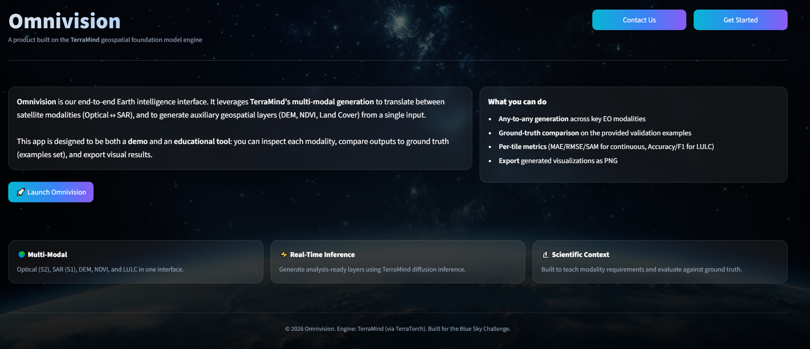
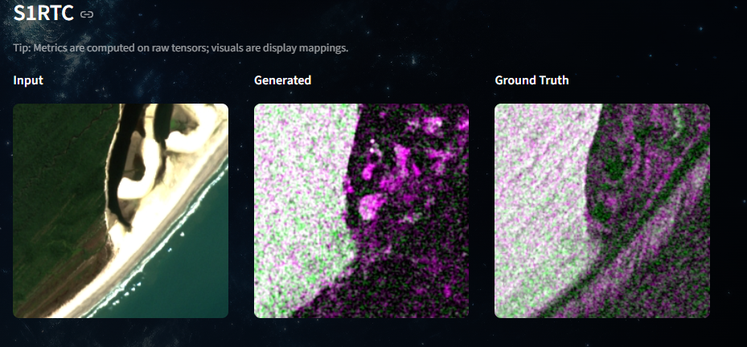
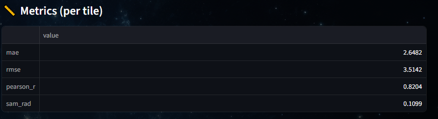
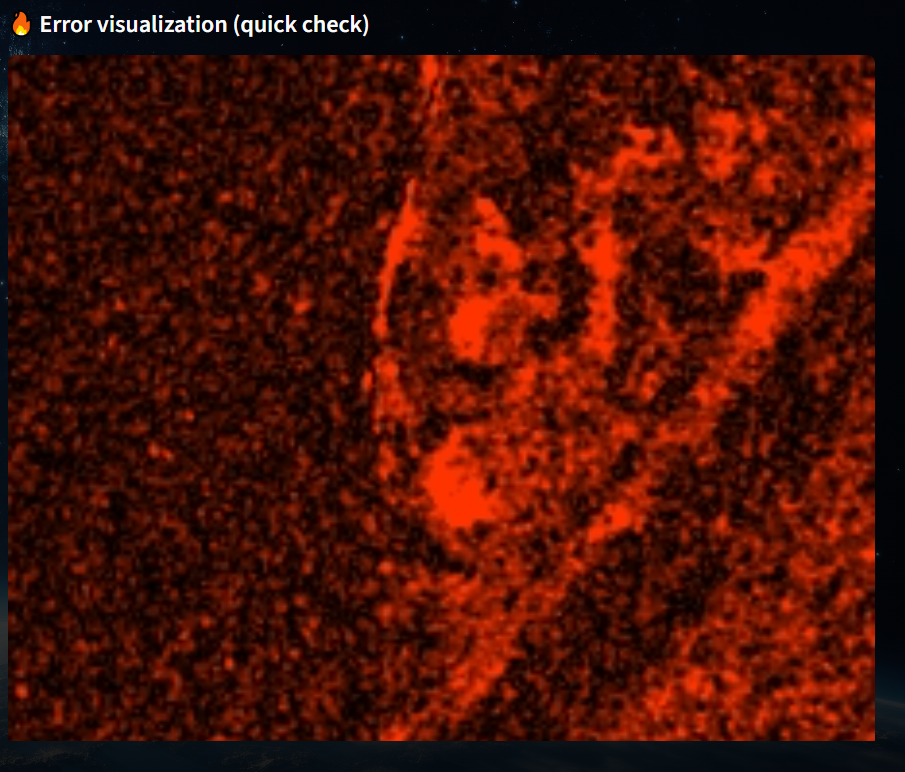
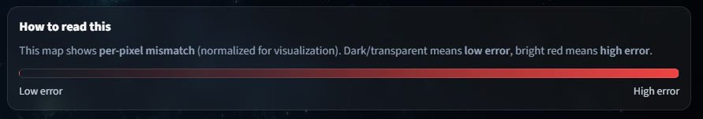

# Omnivision 🛰️🌍 - TerraMind Multi‑Modal Earth Observation Studio

**Omnivision** is an interactive Earth‑observation “lab” built on the **TerraMind** geospatial foundation model (via **TerraTorch**).  
It showcases TerraMind’s **any‑to‑any generation** across key modalities and adds **ground truth comparison, per‑tile metrics, and interpretable error maps**, so results are measurable—not just qualitative.

**Team:** Omnivision  
**Contacts:** rohaanrasool110@gmail.com • tamseelfatimah245@gmail.com • solehsafida@gmail.com  
**Demo video:** https://www.youtube.com/watch?v=yhdLLpik4a0  
**Challenge:** IBM/ESA Geospatial — BlueSky Challenge (Hugging Face Community Submission)

---

## Why it matters
Earth observation workflows increasingly require multi‑sensor data (Optical, SAR, DEM, vegetation indices, land cover). However, working across these modalities is slow and fragmented—different formats, different preprocessing, and limited tools to both **generate** and **validate** derived layers.

**Omnivision** provides a modern, reproducible interface to explore TerraMind’s multi‑modal generation and to **evaluate outputs against ground truth** on the provided example tiles.

---

## What Omnivision does
### Core capabilities
- **Any‑to‑any generation** with TerraMind (select input modality → generate multiple output modalities)
- **Examples mode:** automatically loads matching **Ground Truth** rasters when available (same file id across modalities)
- **Side‑by‑side comparison:** **Input | Generated | Ground Truth**
- **Per‑tile evaluation metrics**
  - Continuous modalities: **MAE, RMSE, Pearson r, SAM**
  - Categorical (LULC): **Overall Accuracy, Macro‑F1**
- **Error visualization** (mismatch map) with an on‑screen legend (low→high error)
- **Download outputs** (PNG visualization) directly from the UI
- **Background handling:** uses `earth_bg.jpeg` if present; otherwise falls back to an animated background

---

## Supported modalities (as in TerraMind notebooks)
- **S2L2A** — Sentinel‑2 Optical (multi‑spectral)
- **S1RTC / S1GRD** — Sentinel‑1 SAR (VV/VH)
- **DEM** — Elevation
- **NDVI** — Vegetation index
- **LULC** — Land Use / Land Cover

---

## Screenshots (from `assets/`)



### Comparison (Input vs Generated vs Ground Truth)


### Metrics + Error Interpretation


### Error Map (Mismatch Visualization)


### Error Legend


---

## How it works (technical summary)
Omnivision uses TerraTorch’s model registry to build TerraMind generation models:

```python
FULL_MODEL_REGISTRY.build(
  "terramind_v1_base_generate",
  modalities=[input_modality],
  output_modalities=[...],
  pretrained=True,
  standardize=True
)

```
# Key Design Decisions

Aligned with the official TerraMind notebooks:

* **standardize=True** applies the correct pretraining normalization internally (no manual normalization required).
* Inputs are aligned to TerraMind’s example tile size **224×224** using a selectable resize strategy.
* **LULC outputs (logits)** are converted to labels via **argmax** for evaluation and visualization.

---

# Installation

## 1) Create a virtual environment (recommended)

### Windows (PowerShell)

```powershell
python -m venv .venv
.venv\Scripts\activate
### Linux/macOS

```bash
python3 -m venv .venv
source .venv/bin/activate
```

## 2) Install dependencies

```bash
pip install -r requirements.txt
```

### PyTorch note (important)

If `pip install torch` fails or you need GPU support, install PyTorch first from:

[https://pytorch.org/get-started/locally/](https://pytorch.org/get-started/locally/)

Then run:

```bash
pip install -r requirements.txt
```

---

# Run the App

```bash
streamlit run app.py
```

Then open the local URL Streamlit prints (usually `http://localhost:8501`).

---

# Examples Dataset

This repository includes an `examples/` folder (used for notebook‑style demos and evaluation).

## Omnivision Supports Two Modes

### 1) Examples Folder Mode (recommended for evaluation)

* Select a modality + example file
* Generate target modalities
* Omnivision loads matching ground truth and computes per‑tile metrics

### 2) Upload GeoTIFF Mode

* Useful for experimentation with user data
* Ground truth comparison is typically not available unless paired reference data is supplied

If you prefer downloading examples instead of using the committed folder:

```bash
python download_examples.py
```

---

# Evaluation Methodology

## How “Accuracy” Is Computed

Omnivision computes metrics **per tile** when Ground Truth is available (Examples mode).

### Continuous Modalities (S2 / S1 / DEM / NDVI)

Computed on **raw arrays** (not display‑normalized):

* MAE (Mean Absolute Error)
* RMSE (Root Mean Square Error)
* Pearson correlation (**r**) (structure similarity)
* SAM (Spectral Angle Mapper, radians; for multi‑band outputs)

### Categorical Modality (LULC)

* Predicted logits → label map via **argmax**

**Metrics:**

* Overall accuracy
* Macro‑F1 (more robust under class imbalance)

---

# Error Visualization

A visual mismatch map is shown:

* Dark / transparent = low error
* Bright red = high error

A legend is displayed in‑app for interpretation.

---

# UI Controls Explained

## Diffusion Steps

Controls the number of iterative refinement steps used by the diffusion sampler:

* Lower = faster, usually less detailed
* Higher = slower, sometimes better detail
* Default **10** matches the official TerraMind notebooks

## Resize Mode

Controls how input data is aligned to **224×224**:

* `center_crop_then_resize` (recommended): crop if large, resize if small
* `resize`: always resize (can distort)
* `center_crop`: crop only (fails if smaller than 224)

---

# Repository Contents

* `app.py` — Streamlit UI (landing page + dashboard + evaluation UI)
* `omnivision_engine.py` — TerraMind / TerraTorch model wrapper and modality rendering
* `download_examples.py` — downloads example tiles (if needed)
* `requirements.txt` — dependencies for reproducibility
* `assets/` — screenshots used in README and submission
* `examples/` — example tiles for evaluation mode
* `earth_bg.jpeg` — optional background image (used if present)

---

# Credits

* **TerraMind model & notebooks:** [https://github.com/IBM/terramind](https://github.com/IBM/terramind)
* **TerraTorch registry & utilities:** [https://github.com/IBM/terratorch](https://github.com/IBM/terratorch)
* **BlueSky Challenge Space:** [https://huggingface.co/spaces/ibm-esa-geospatial/challenge](https://huggingface.co/spaces/ibm-esa-geospatial/challenge)

---

# License

Released under the **MIT License** (see `LICENSE`).

---

# Contact

* [rohaanrasool110@gmail.com](mailto:rohaanrasool110@gmail.com)
* [tamseelfatimah245@gmail.com](mailto:tamseelfatimah245@gmail.com)
* [solehsafida@gmail.com](mailto:solehsafida@gmail.com)
